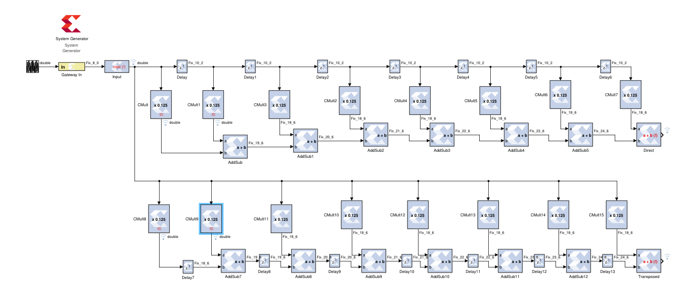

# HW 7 - Files

## HW7 
Basic filter Direct vs Transposed implementation

## HW7_2

Filter cascading model with N=8 and N=64 

## HW7_3

Top level project to import into the ethernet. Signals are routed to an input and an output port for easy access
 

